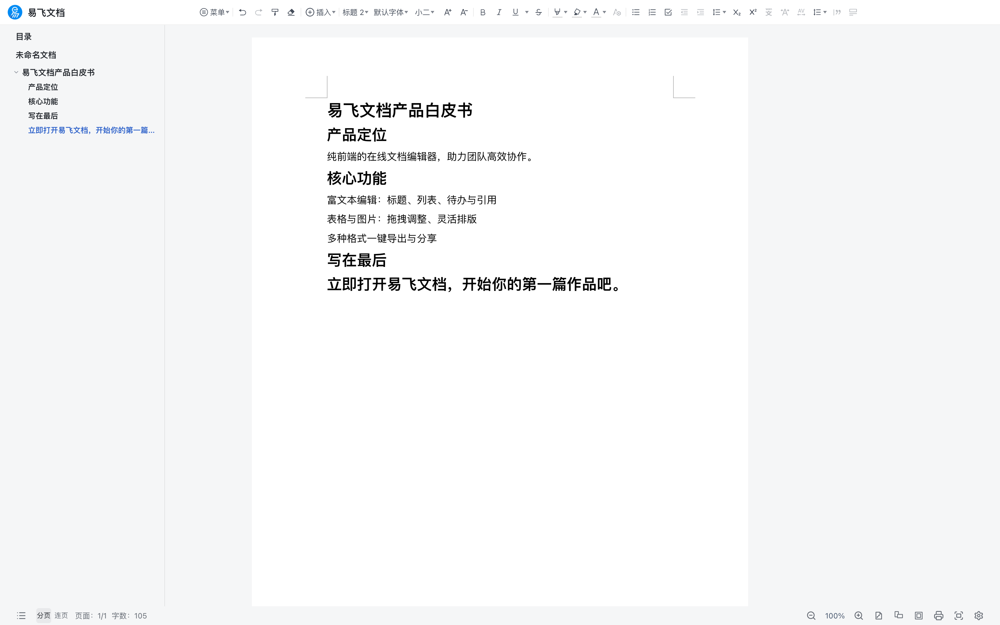
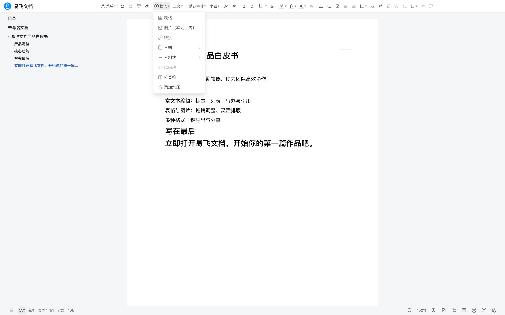
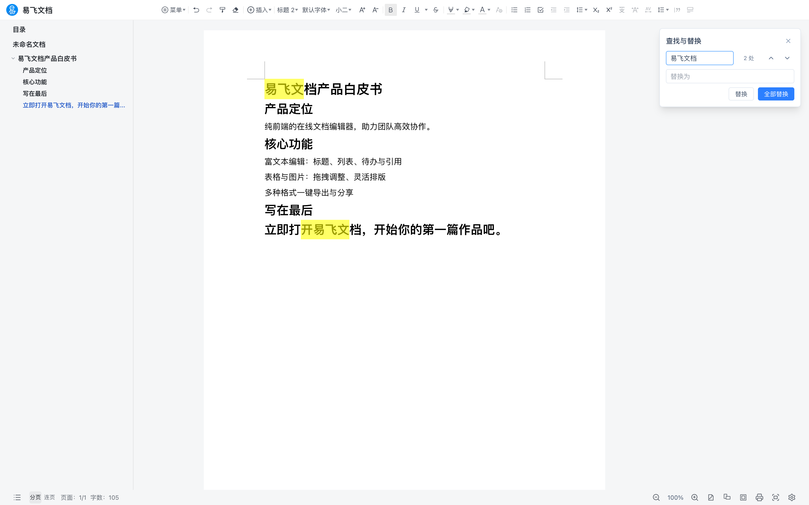

# EFLink Word 易飞文档

参照企业微信在线文档布局的纯前端 Word 编辑器。基于 [canvas-editor](https://github.com/Hufe921/canvas-editor) 排版引擎与 React 构建，**既可以独立运行（本仓库 demo 应用），也可以作为 React 组件嵌入任意应用**（npm 包 `@eflink-tech/word`）。

A Word-like document editor for the web. Run it standalone, or embed `<WordEditor />` into your React app.

## 截图预览

| 文档编辑 | 插入菜单 | 查找替换 |
| --- | --- | --- |
|  |  |  |

## 功能特性

- 排版引擎：canvas-editor（Apache-2.0，所见即所得分页排版）
- 企微式界面：单行工具栏（窄屏自动折叠）、左侧目录（滚动高亮、窄屏折叠为悬浮标签）、底部状态栏
- 编辑能力：字体/字号/标题/对齐/行高/下划线样式、上下标、列表、引用、分割线、页眉页脚页码、水印、纸张尺寸与方向、页边距、查找替换、格式刷、表格/图片/链接/日期插入
- 文件能力：自有 `.efword`（JSON）备份格式导入导出、导出 PDF（与打印预览一致的 canvas 渲染）
- 持久化：可插拔存储适配器（内置 IndexedDB / 内存），防抖自动保存 + Ctrl/Cmd+S 手动保存
- 工程化：Vite + TypeScript 严格模式 + Vitest 单测 + oxlint

## 使用组件

```bash
npm install @eflink-tech/word
```

```tsx
import { WordEditor } from '@eflink-tech/word';
import '@eflink-tech/word/styles.css';

function Page() {
  return (
    <div style={{ height: '100vh' }}>
      <WordEditor docId={docId} />
    </div>
  );
}
```

不传 `storage` 时默认使用内置 IndexedDB 存储（库名 `eflink-word`）。组件高度跟随父容器（`height: 100%`），页面级 `html/body` 高度与字体由宿主提供。

### WordEditor Props

| Prop | 类型 | 默认 | 说明 |
| --- | --- | --- | --- |
| `docId` | `string` | 必填 | 要打开的文档 id，内容经 storage 加载 |
| `storage` | `StorageAdapter` | 内置 IndexedDB | 文档存储实现；传入后注册为全局默认 |
| `branding` | `{ logo?: string; name: string } \| false` | `false` | 左上角品牌区（logo + 名称） |
| `showToolbar` | `boolean` | `true` | 是否显示工具栏 |
| `showCatalog` | `boolean` | `true` | 是否显示左侧目录 |
| `showStatusBar` | `boolean` | `true` | 是否显示底部状态栏 |
| `guardUnload` | `boolean` | `false` | 有未保存修改时拦截页面关闭（独立站点建议开启） |
| `onDocIdChange` | `(id: string) => void` | — | 新建文档等导致当前文档变化时回调（宿主据此同步路由） |
| `onDocLoaded` | `(doc: WordDocument) => void` | — | 文档加载完成回调 |
| `onDocError` | `(err: unknown) => void` | — | 文档加载失败/不存在回调 |

组件不依赖路由：像「新建文档」这类会切换当前文档的动作，统一经 `onDocIdChange` 交还宿主处理。`docId` 变化时组件会自动加载新文档。

### 存储适配器

编辑器所有落库行为都经由 `StorageAdapter`，宿主可注入自己的实现对接后端：

```ts
import type { StorageAdapter } from '@eflink-tech/word';
import { memoryStorage, setDefaultStorage } from '@eflink-tech/word';

// 内置：内存存储（无痕场景/测试）
setDefaultStorage(memoryStorage());

// 自定义：对接你的服务端
const restStorage: StorageAdapter = {
  save: (doc) => fetch('/api/docs', { method: 'POST', body: JSON.stringify(doc) }).then(() => undefined),
  load: (id) => fetch(`/api/docs/${id}`).then((r) => r.json()),
  list: () => fetch('/api/docs').then((r) => r.json()),
  delete: (id) => fetch(`/api/docs/${id}`, { method: 'DELETE' }).then(() => undefined),
  rename: (id, title) => fetch(`/api/docs/${id}/rename`, { method: 'POST', body: JSON.stringify({ title }) }).then(() => undefined),
  updateContent: (id, title, content) => fetch(`/api/docs/${id}`, { method: 'PUT', body: JSON.stringify({ title, content }) }).then(() => undefined),
};
```

### headless API

不经 UI 直接使用数据模型与导入导出：

```ts
import {
  createWordDocument,
  exportEfword,
  importEfword,
  exportPdf,
  useEditorStore,
} from '@eflink-tech/word';

const doc = createWordDocument('我的文档');   // 新文档（不落库，落库走 storage.save）
const editor = useEditorStore.getState().editor;
await exportEfword(editor, doc.title);        // 下载 .efword 备份文件（JSON）
await exportPdf(editor, doc.title);           // 导出 PDF
```

嵌入宿主可在 `exportEfword` 的第三个参数覆盖 `source`，标识导出文件出自你的应用。

### 状态读取

三个 zustand store 对外导出，宿主可订阅或直接操作：

- `useDocumentStore`：文档列表、当前文档、新建/重命名/删除/收藏
- `useEditorStore`：canvas-editor 实例、页码/缩放/字数、脏标记与保存
- `useUIStore`：视图模式、纸张、页边距、水印、页眉页脚页码配置（含 `PAPER_SIZES`/`MARGIN_PRESETS` 预设）

## 本地运行 Demo

```bash
pnpm install
pnpm dev          # 并行：组件库 watch 构建 + demo dev server
# 或
pnpm dev:demo     # 仅 demo（需先 pnpm --filter @eflink-tech/word build）
```

打开终端提示的地址即为完整独立应用：自动打开最近文档（没有则新建）、工具栏、目录、导入导出、自动保存，行为与本仓库线上 demo 一致。

## 目录结构

```
eflink-word/
├── packages/word/      # @eflink-tech/word 组件库（开源主体）
│   └── src/
│       ├── components/ # WordEditor、工具栏、目录、状态栏、颜色面板等
│       ├── core/       # canvas-editor 封装、.efword/PDF 导入导出
│       ├── storage/    # StorageAdapter 接口与内置实现
│       ├── store/      # zustand 状态
│       └── index.ts    # 对外导出面
└── apps/demo/          # 独立运行的应用（易飞文档）：路由、品牌、最近文档逻辑
```

## 开发

```bash
pnpm lint         # oxlint
pnpm typecheck    # tsc -b
pnpm test         # vitest 单元测试
pnpm build        # 构建组件库与 demo
```

### 边界与已知约定

- 一个页面同时只挂一个编辑器实例（canvas-editor 实例为模块级单例）
- 编辑器不读写 `localStorage`/`document.title` 等宿主全局（「最近文档」等属宿主职责，经 `onDocLoaded` 回调实现）；「最近颜色」为唯一例外，仅存 UI 偏好
- 组件不依赖路由库；路由、文档列表页、用户体系均属宿主职责
- `.efword` 为 JSON 备份格式，不兼容 `.docx`；PDF 导出与打印预览一致（canvas 渲染）
- 不做服务端同步与协同编辑

## 联系我们

- **在线体验**：<https://eflink.tech>（易飞文档 · 免费在线文档编辑器）
- **问题反馈与交流**：[eflink.tech/contact](https://eflink.tech/contact)
- **邮箱**：[support@eflink.tech](mailto:support@eflink.tech)

使用微信或企业微信扫码添加（二维码长期有效）：

<p align="center">
  
</p>

## License

[MIT](./LICENSE)
